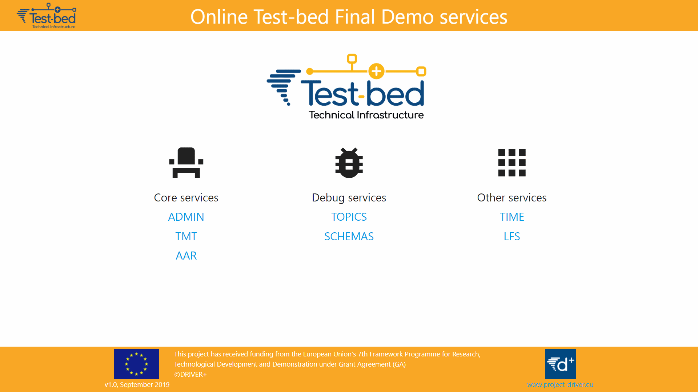

# Homepage

A reverse proxy and home page combined, offering easy access to all services.



## Installation

Just run:

```bash
npm i
# Or, for a smaller footprint, uses `pnpm i`
```

## Production

For the home page to work, it needs to know the location of the Test-bed services. So you need to specify them via the environment by setting:

```bash
set tmt='localhost:3210'
set rest='localhost:8082'
set topics='localhost:3600'
set schemas='localhost:3601'
set admin='localhost:8090'
set aar='localhost:8095'
set ost='localhost:8050'
set time='localhost:8100'
set lfs='localhost:9090'

npm run production
```

## Development

```bash
set tmt='localhost:3210'
set rest='localhost:8082'
set topics='localhost:3600'
set schemas='localhost:3601'
set admin='localhost:8090'
set aar='localhost:8095'
set ost='localhost:8050'
set time='localhost:8100'
set lfs='localhost:9090'

npm start
```

## Docker

In order to build a new image, run `npm run docker:local`. You can test it using `npm run docker:run` (use another terminal to stop your container) or `npm run docker:sh` to enter it. When you are happy with it, run `npm run docker` to publish it to the Docker hub.

Since the reverse proxy needs to access the services, you need to specify their location. Typically, running outside a  Docker container, you would refer to `localhost:port`. However, inside a Docker container, you refer to a service by its container name, i.e. `container:port`. For example, consider the following.

```yaml
  homepage:
    image: drivereu/homepage
    ports:
      - '80:80'
      - '443:443'
    environment:
      title: Test-bed FD
      email: your.email@gmail.com
      # ssl: true  # When running in production, and you want to use letsencrypt to get the certificates.
      admin: admintool:8090
      tmt: trial_management_tool:3210
      aar: afteractionreview:8095
      lfs: large_file_service:9090
      time: time_service:8100
      schemas: kafka_schema_registry_ui:8000
      topics: kafka_topics_ui:8000
    volumes:
      - certs:/usr/src/app/certs # For saving the letsencrypt certificates
```

### Proxy configuration

The reverse proxy functionality is based on [Redbird](https://github.com/OptimalBits/redbird), using custom resolvers for most test-bed services. Since the subdomain is used to indicate the test-bed, relative paths are used for the services. In case the service is accessing hard-coded paths, e.g. `/static/js/...`, and you are getting error messages about routes that cannot be resolved, you may need to add explicit rules for those files too. See the examples provided.

To add a new service, decide what path you want to use and to what port address you want to redirect it, and start with a standard proxy, e.g.:

```js
const my_service = process.env.my_service; // Port of the service

if (my_service) {
  proxy.register(`${hostname}/my_service`, `${ip}:${my_service}`);
}
```

Sometimes, this is sufficient, but a web service often requires many files that cannot be found in this way, for example to access an API. In that case, you need a custom resolver that redirects traffic accordingly. For example, the After-Action-Review service requires the following:

```js
if (aar) {
  var aarUI = function(host, url, req) {
    if (
      /^\/aar\//.test(url) ||
      /\/AARService/.test(url) ||
      /\/static\/js/.test(url) ||
      /\/static\/img/.test(url) ||
      /\/static\/css/.test(url)
    ) {
      req.url = url.replace(/^\/aar/, '');
      return { url: `${ip}:${aar}/` };
    }
  };
  aarUI.priority = 100;
  resolvers.push(aarUI);
}
```

Since this custom resolver redirects all `/static/js`, `/static/img`, `/static/css` this is also somewhat of a red flag, as you may have multiple services that want you to redirect those specific paths, and if they are not unique, how can you distinguish between them.

### Home page

At the same time, a website is created to have easy access to all these services.
